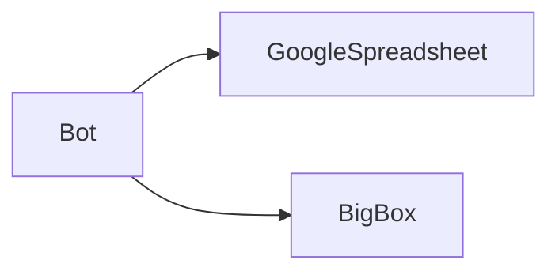
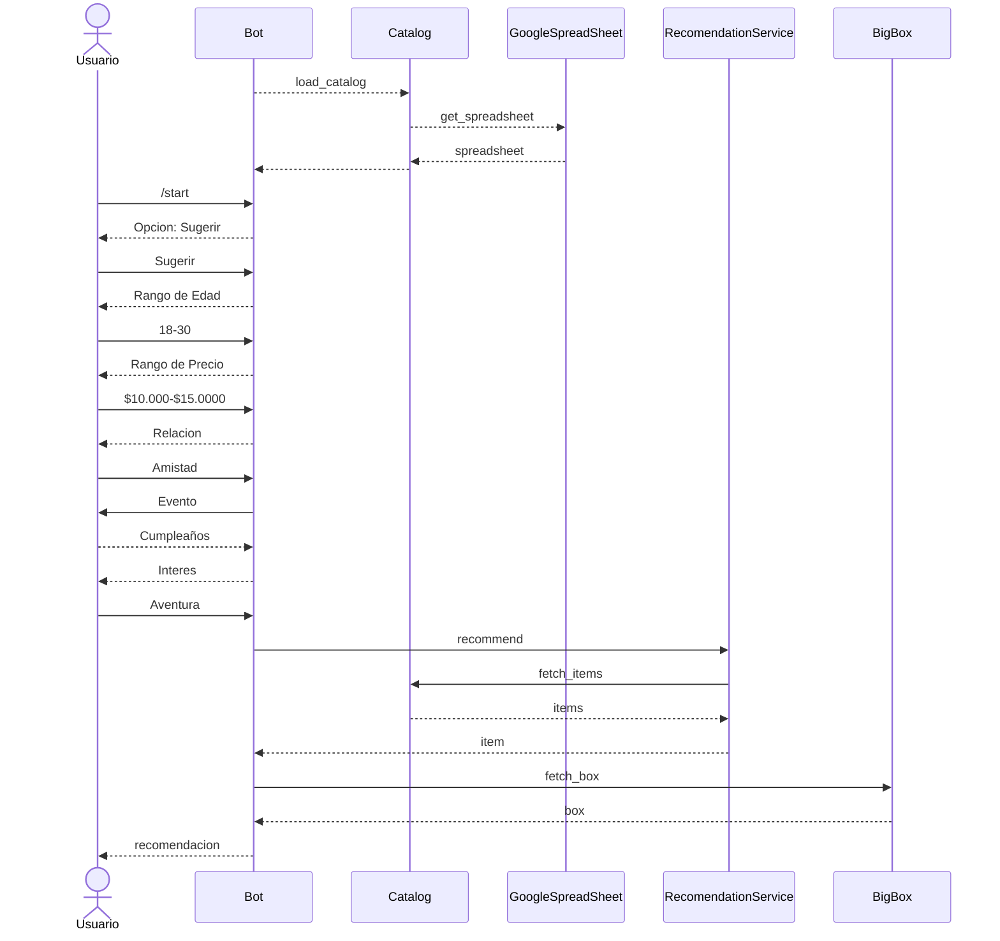

# Nova Regalo Bot 🎁🤖

NovaRegaloBot simplifica el proceso de elección de regalos al personalizar las sugerencias basadas en los gustos y preferencias de la persona a la que deseas sorprender. Ya sea para un cumpleaños, aniversario o cualquier ocasión especial, nuestra herramienta analiza información clave como la relación con la persona, sus intereses, la ocasión y tu presupuesto, para presentarte opciones perfectas.

# 🛠️ Desarrollo
Para instalar novabot, vas a necesitar de tener instalado 
* Python 3.6 o superior
* poetry

Para instalar poetry, puedes seguir las instrucciones en la [documentación oficial](https://python-poetry.org/docs/)
Una vez que tengas poetry instalado, puedes instalar las dependencias del proyecto con el siguiente comando:
```bash
poetry install
```

# 🔑 Tokens y claves de acceso
El bot se conecta con google spreedshet, vas a necesitar de contar con las credenciales para poder acceder a la hoja de cálculo. Para obtener el token.json, puedes seguir las instrucciones en la [documentación oficial](https://developers.google.com/sheets/api/quickstart/python)

Tambien vas a necesitar de contar con las credenciales de telegram, para obtenerlas puedes seguir las instrucciones en la [documentación oficial](https://core.telegram.org/bots#botfather)
Una vez que tengas las credenciales vas a tener que guardarlas en un archivo llamado telegram_bot_token.txt.

# 🚀 Ejecutar el bot
```bash
poetry run python -m bot.py
```

# 📐 Arquitectura

## 🎼 Diagrama de Componentes


## ➡️ Diagrama de Sequencia

